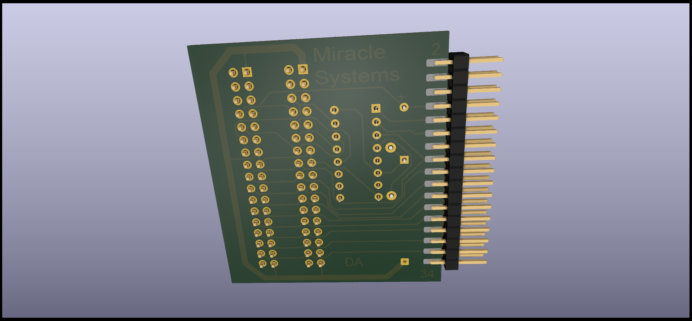

# 4 DISC DRIVE ADAPTER FOR MIRACLE DISC INTERFACE.

(C) 2023 Alvaro Alea Fernandez

License under: CERN Open Hardware Licence Version 2 - Strongly Reciprocal

https://ohwr.org/cern_ohl_s_v2.txt

This board has been reverse engineered from pictures.

THIS BOARD HAS NOT BEEN TESTED!! Use at your own risk.

## Information

This adapter is intended to connect 4 disc drives to one interface disc on the Sinclair QL Computer.

You need 2 pair of disc drives, with plain cables, on each par one drive shall be configured as DS0 and the another as DS1

The drives conected to the middle conector will be FLP1 and FLP2, and the drives conected to the outher conector will be FLP3 and FLP4

